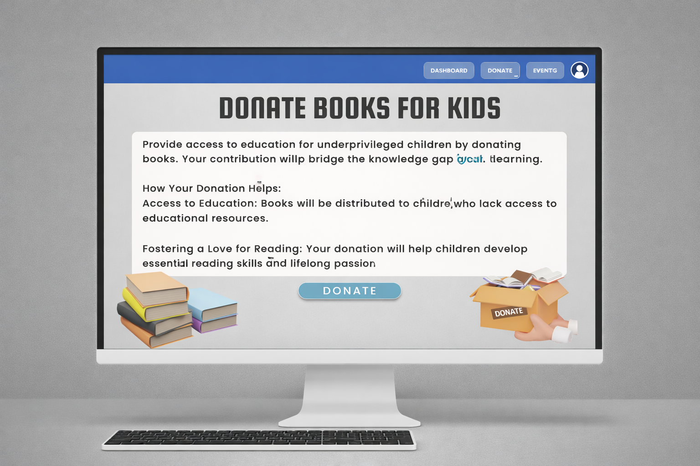
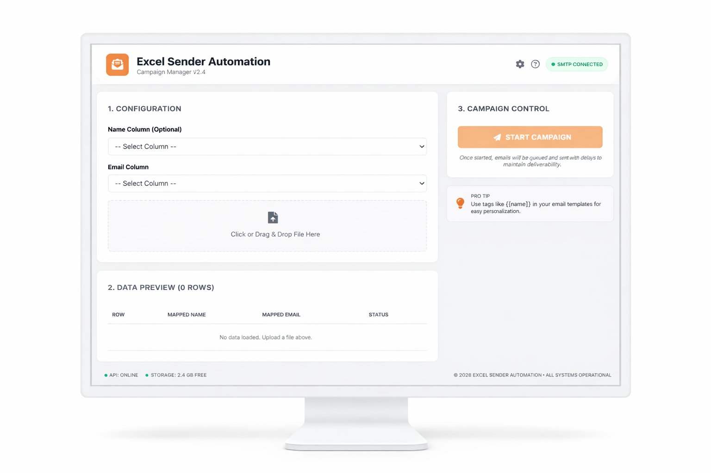
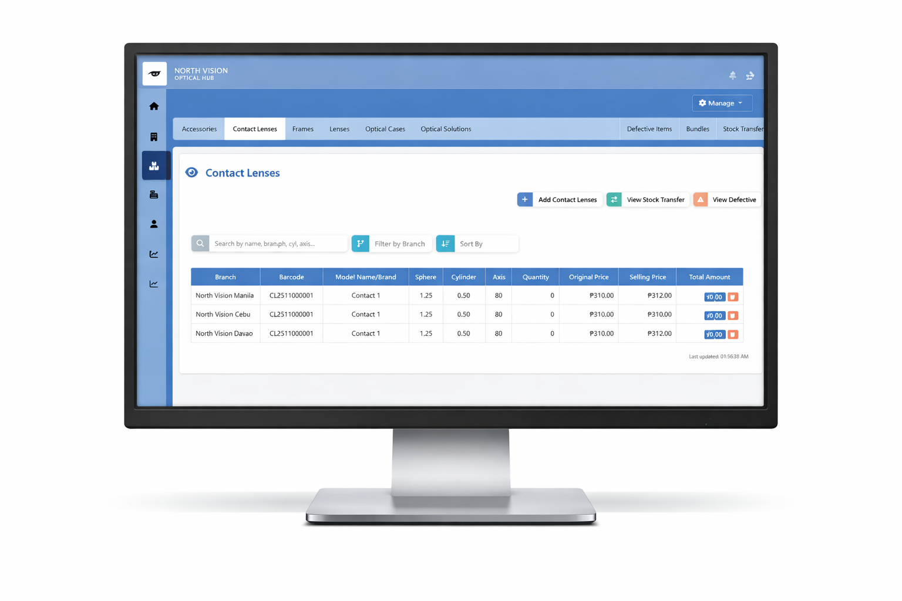

# Gerald Balete Professional Software Portfolio

Welcome to the official repository for Gerald Balete's interactive software developer portfolio. This platform serves as a modern showcase of Gerald's engineering experience, core projects, academic achievements, and professional skills. The application is built using high-performance React, TypeScript, Vite, custom HSL CSS styling, and Framer Motion for premium micro-animations.

It also integrates a secure, intelligent AI Chat Assistant that acts as a virtual recruiter's guide, answering queries in real-time regarding Gerald's professional background.

## Previews and Screenshots

Below are visual previews of platforms, dashboards, and projects showcased within this portfolio:







## Core Features

### 1. Gemini AI Chat Assistant
An advanced virtual assistant powered by the Gemini 3.1 Flash Lite API, integrated directly via native fetch requests. It provides:
- Professional Resume Insight: Instantly shares accurate information regarding Gerald's roles, skills, certifications, awards, and site navigation.
- Safe Configuration: Tight guardrails restrict the assistant from discussing personal, political, controversial, or unrelated topics, and prevent code execution or jailbreak attempts.
- Session Reset: Message logs are completely cleared upon closing the window to guarantee a secure, fresh session on reopening.

### 2. Interactive Multilingual Support and Text-To-Speech
- Real-Time Translation: If a visitor asks a question in a language other than English, the Gemini AI automatically translates its reply to match their language.
- Accurate Text-to-Speech: The assistant returns bracketed ISO language tags (such as [es-ES] or [ja-JP]) allowing the browser's SpeechSynthesis utterance API to read the response out loud with native pronunciation, while stripping the tags from the display window.

### 3. Secure Strike Lockout System
To prevent malicious behavior, profanity, spamming, or prompt-injection attempts, the chat has a built-in strict moderation engine:
- Striking Guardrails: Any bad words, offensive queries, or jailbreak attempts are met with a formal warning and cost the visitor a strike.
- Five-Minute Suspension: Accumulating 3 strikes instantly locks the visitor out of the chat using a secure browser timer persisted in local storage.

### 4. Project Workspace and Custom Scheduler
A fully responsive, in-app event coordinator and scheduler:
- Booking Coordinator: Allows potential clients or recruiters to manage meeting details directly from the portfolio.
- Local Notifications: Integrates local browser alert callbacks to notify users of upcoming scheduled slots.

## Technology Stack

- Frontend Library: React (Functional components, hooks, custom state providers)
- Language: TypeScript (Strict type checks, robust data interfaces)
- Development Environment: Vite (Ultra-fast Hot Module Replacement)
- Animations: Framer Motion (Bouncy floating triggers, scroll transitions, clean UI layouts)
- Styling: Custom HSL CSS system (Designed for responsiveness, vibrant contrast themes, and optimized cross-device rendering)
- Icon Pack: Lucide React (Clean, minimal outline assets)
- Backend Integration: Gemini 3.1 Flash Lite API

## Local Setup Instructions

Follow these instructions to configure and run the portfolio codebase locally on your machine.

### Prerequisites
Make sure you have Node.js (version 18 or above) and npm installed.

### 1. Install Dependencies
Navigate to the project root directory and execute:
```bash
npm install
```

### 2. Configure Environment Variables
Create a file named `.env` in the root directory and configure your Gemini API Key:
```env
VITE_GEMINI_API_KEY=your_gemini_api_key_here
```
Note: You can secure a free API key directly from Google AI Studio.

### 3. Run Development Server
To launch the application locally in development mode:
```bash
npm run dev
```
Open your browser and navigate to `http://localhost:5173`.

### 4. Build for Production
To bundle and optimize the project assets for deployment:
```bash
npm run build
```

## Production Deployment and Git Synchronization

The project is structured to easily push updates to multiple production and repository environments.

### Pushing to Core Backup
To push to the primary GitHub repository backup:
```bash
git add .
git commit -m "commit message"
git push origin main
```

### Pushing to Vercel Deploy Remote
To push to the deployment remote (chalisterrald) which automatically triggers a live production rebuild in Vercel:
```bash
git push second main
```

## Developer Information

- Developer: Gerald Balete
- Focus Areas: Full-Stack Web Development, UI/UX Engineering, Quality Assurance & Software Automation
